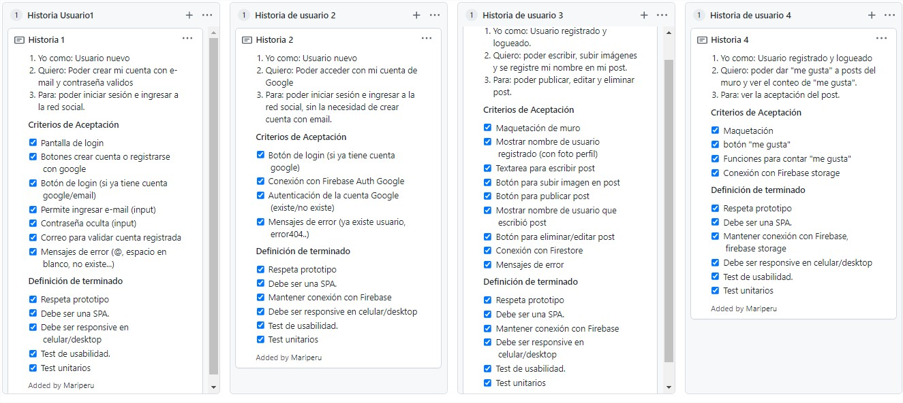
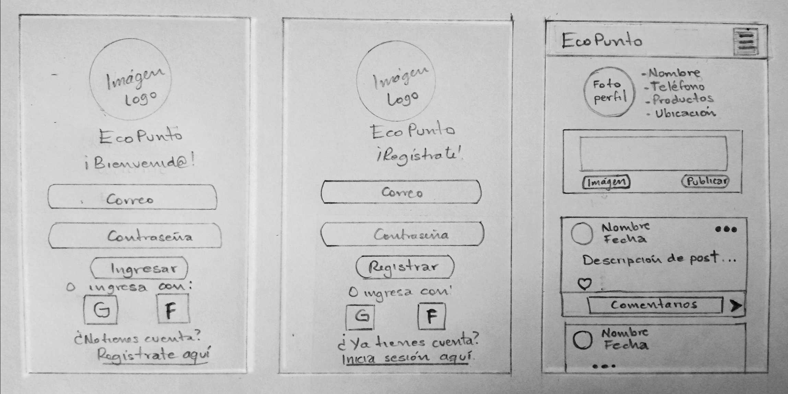
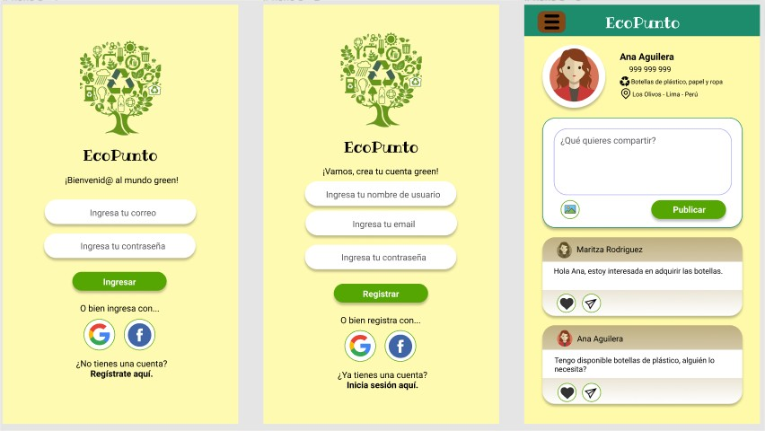
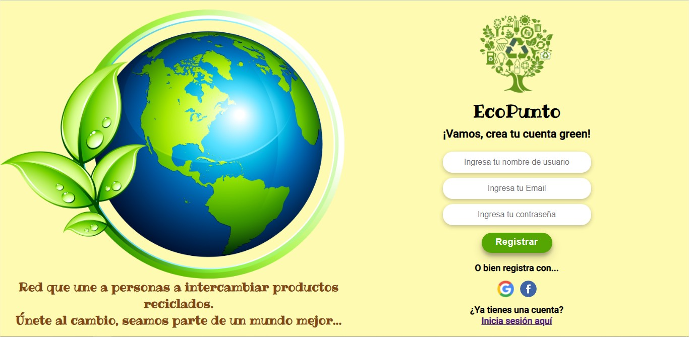
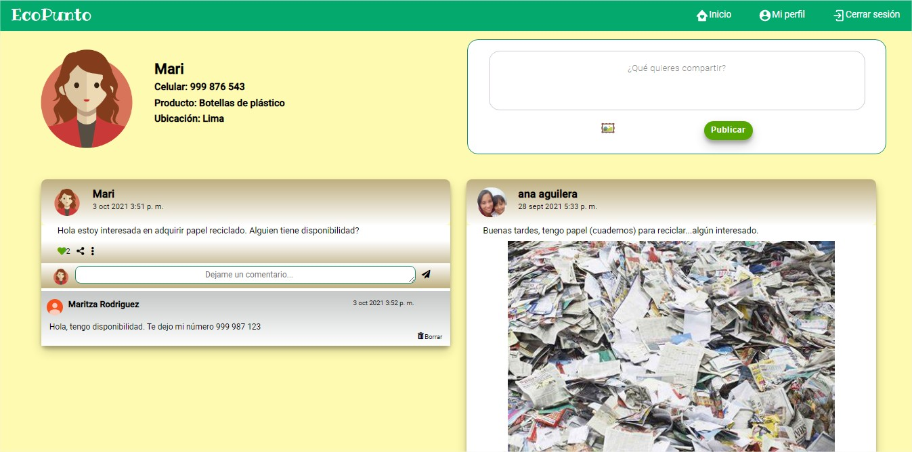

# ♻️ EcoPunto 🌳

## ♻️ Índice

- [1. Definición del producto](#1-definición-del-producto)
- [2. Historias de usuario](#2-historias-de-usuario)
- [3. Diseño de la Interfaz de Usuario](#3-diseño-de-la-interfaz-de-usuario)
- [4. Prototipo](#4-prototipo)
- [5. Entrevistas con usuarios](#5-entrevistas-con-usuarios)
- [6. Test de usabilidad](#6-test-de-usabilidad)
- [7. Objetivos de aprendizaje](#7-objetivos-de-aprendizaje)

## 1. Definición del producto

🌳 EcoPunto es una red social que promueve el intercambio, donación o búsqueda de materiales reciclados. ♻️

- **Principales usuarios del producto** 🙋‍♂️🙋‍♀️

  - **Proveedor de material reciclado:** personas que quieren donar o intercambiar material reciclado (botellas de plástico, ropa usada, latas, papel reciclado, cartones, libros usados, muebles usados, artefactos usados, otros).
  - **Recolector de material reciclado:** personas interesadas en adquirir productos en desuso, que puedan reciclarse para volver a darle un nuevo uso.

- **Problema que resuelve** 💡

  1. La dificultad para encontrar en la web a personas interesadas en adquirir material reciclado.
  2. La preocupación para ubicar un lugar donde llevar productos en desuso
  3. Ayuda a disminuir la contaminación por residuos sólidos y fomenta la cultura de reciclaje.

  La red social servirá para poner fácilmente en contacto a proveedores y recolectores de material reciclado.

## 2. Historias de usuario

## 3. Diseño de la Interfaz de Usuario

Prototipo de baja fidelidad. ✍️

## 4. Prototipo

Prototipo de alta fidelidad. 🎨

- Vista mobile 📱
  

- Vista Desktop 💻
  
  
  

## 5. Entrevistas con usuarios

Apreciación del prototipo de alta fidelidad:

- 🎤 Entrevista 1:
  Realizado por una mujer de 31 años, estudiante FrontEnd.

  - Buena combinación de colores, van relacionados a la temática del proyecto.
  - Los colores de las letras facilitan la lectura.

- 🎤 Entrevista 2:
  Realizado por una mujer de 27 años, estudiante FrontEnd.

  - En la vista de register, agregar un input para nombre de usuario.
  - Buena combinación de colores, van relacionados a la temática del proyecto.

## 6. Test de usabilidad

- 👩‍🔬 Test 1:
  Se mostró cómoda porque entendió la funcionalidad de los inputs y botones.

- 👨‍🔬 Test 2:
  Recomendó adicionar un poco más de información en la vista de registro, para que el usuario tenga claro de qué se trata la red social. Por lo demás, el usuario mencionó que la página es comprensible y amigable.

- 👨‍🔬 Test 3:
  El usuario indicó que comprendió la funcionalidad de la red social, no hubo inconvenientes.

## 7. Objetivos de aprendizaje

### 📚 HTML

- [x] **Uso de HTML semántico**

    

Links

  - [HTML semántico](https://curriculum.laboratoria.la/es/topics/html/02-html5/02-semantic-html)
  - [Semantics - MDN Web Docs Glossary](https://developer.mozilla.org/en-US/docs/Glossary/Semantics#Semantics_in_HTML)
  

### 📚 CSS

- [x] **Uso de selectores de CSS**

    

Links

  - [Intro a CSS](https://curriculum.laboratoria.la/es/topics/css/01-css/01-intro-css)
  - [CSS Selectors - MDN](https://developer.mozilla.org/es/docs/Web/CSS/CSS_Selectors)
  

- [x] **Modelo de caja (box model): borde, margen, padding**

    

Links

  - [Box Model & Display](https://curriculum.laboratoria.la/es/topics/css/01-css/02-boxmodel-and-display)
  - [The box model - MDN](https://developer.mozilla.org/en-US/docs/Learn/CSS/Building_blocks/The_box_model)
  - [Introduction to the CSS box model - MDN](https://developer.mozilla.org/en-US/docs/Web/CSS/CSS_Box_Model/Introduction_to_the_CSS_box_model)
  - [CSS display - MDN](https://developer.mozilla.org/pt-BR/docs/Web/CSS/display)
  - [display - CSS Tricks](https://css-tricks.com/almanac/properties/d/display/)
  

- [x] **Uso de flexbox en CSS**

    

Links

  - [A Complete Guide to Flexbox - CSS Tricks](https://css-tricks.com/snippets/css/a-guide-to-flexbox/)
  - [Flexbox Froggy](https://flexboxfroggy.com/#es)
  - [Flexbox - MDN](https://developer.mozilla.org/en-US/docs/Learn/CSS/CSS_layout/Flexbox)
  

- [x] **Uso de CSS Grid Layout**

    

Links

  - [A Complete Guide to Grid - CSS Tricks](https://css-tricks.com/snippets/css/complete-guide-grid/)
  - [Grids - MDN](https://developer.mozilla.org/en-US/docs/Learn/CSS/CSS_layout/Grids)
  

### 📚 Web APIs

- [x] **Uso de selectores del DOM**

    

Links

  - [Manipulación del DOM](https://curriculum.laboratoria.la/es/topics/browser/02-dom/03-1-dom-methods-selection)
  - [Introducción al DOM - MDN](https://developer.mozilla.org/es/docs/Web/API/Document_Object_Model/Introduction)
  - [Localizando elementos DOM usando selectores - MDN](https://developer.mozilla.org/es/docs/Web/API/Document_object_model/Locating_DOM_elements_using_selectors)
  

- [x] **Manejo de eventos del DOM (listeners, propagación, delegación)**

    

Links

  - [Introducción a eventos - MDN](https://developer.mozilla.org/es/docs/Learn/JavaScript/Building_blocks/Events)
  - [EventTarget.addEventListener() - MDN](https://developer.mozilla.org/es/docs/Web/API/EventTarget/addEventListener)
  - [EventTarget.removeEventListener() - MDN](https://developer.mozilla.org/es/docs/Web/API/EventTarget/removeEventListener)
  - [El objeto Event](https://developer.mozilla.org/es/docs/Web/API/Event)
  

- [x] **Manipulación dinámica del DOM**

    

Links

  - [Introducción al DOM](https://developer.mozilla.org/es/docs/Web/API/Document_Object_Model/Introduction)
  - [Node.appendChild() - MDN](https://developer.mozilla.org/es/docs/Web/API/Node/appendChild)
  - [Document.createElement() - MDN](https://developer.mozilla.org/es/docs/Web/API/Document/createElement)
  - [Document.createTextNode()](https://developer.mozilla.org/es/docs/Web/API/Document/createTextNode)
  - [Element.innerHTML - MDN](https://developer.mozilla.org/es/docs/Web/API/Element/innerHTML)
  - [Node.textContent - MDN](https://developer.mozilla.org/es/docs/Web/API/Node/textContent)
  

- [x] **Ruteado (History API, evento hashchange, window.location)**

    

Links

  - [Manipulando el historial del navegador - MDN](https://developer.mozilla.org/es/docs/DOM/Manipulando_el_historial_del_navegador)
  

### 📚 JavaScript

- [x] **Arrays (arreglos)**

    

Links

  - [Arreglos](https://curriculum.laboratoria.la/es/topics/javascript/04-arrays)
  - [Array - MDN](https://developer.mozilla.org/es/docs/Web/JavaScript/Reference/Global_Objects/Array/)
  - [Array.prototype.sort() - MDN](https://developer.mozilla.org/es/docs/Web/JavaScript/Reference/Global_Objects/Array/sort)
  - [Array.prototype.forEach() - MDN](https://developer.mozilla.org/es/docs/Web/JavaScript/Reference/Global_Objects/Array/forEach)
  - [Array.prototype.map() - MDN](https://developer.mozilla.org/es/docs/Web/JavaScript/Reference/Global_Objects/Array/map)
  - [Array.prototype.filter() - MDN](https://developer.mozilla.org/es/docs/Web/JavaScript/Reference/Global_Objects/Array/filter)
  - [Array.prototype.reduce() - MDN](https://developer.mozilla.org/es/docs/Web/JavaScript/Reference/Global_Objects/Array/Reduce)
  

- [x] **Objetos (key, value)**

    

Links

  - [Objetos en JavaScript](https://curriculum.laboratoria.la/es/topics/javascript/05-objects/01-objects)
  

- [x] **Diferenciar entre tipos de datos primitivos y no primitivos**

- [x] **Variables (declaración, asignación, ámbito)**

    

Links

  - [Valores, tipos de datos y operadores](https://curriculum.laboratoria.la/es/topics/javascript/01-basics/01-values-variables-and-types)
  - [Variables](https://curriculum.laboratoria.la/es/topics/javascript/01-basics/02-variables)
  

- [x] **Uso de condicionales (if-else, switch, operador ternario, lógica booleana)**

    

Links

  - [Estructuras condicionales y repetitivas](https://curriculum.laboratoria.la/es/topics/javascript/02-flow-control/01-conditionals-and-loops)
  - [Tomando decisiones en tu código — condicionales - MDN](https://developer.mozilla.org/es/docs/Learn/JavaScript/Building_blocks/conditionals)
  

- [x] **Uso de bucles/ciclos (while, for, for..of)**

    

Links

  - [Bucles (Loops)](https://curriculum.laboratoria.la/es/topics/javascript/02-flow-control/02-loops)
  - [Bucles e iteración - MDN](https://developer.mozilla.org/es/docs/Web/JavaScript/Guide/Loops_and_iteration)
  

- [x] **Funciones (params, args, return)**

    

Links

  - [Funciones (control de flujo)](https://curriculum.laboratoria.la/es/topics/javascript/02-flow-control/03-functions)
  - [Funciones clásicas](https://curriculum.laboratoria.la/es/topics/javascript/03-functions/01-classic)
  - [Arrow Functions](https://curriculum.laboratoria.la/es/topics/javascript/03-functions/02-arrow)
  - [Funciones — bloques de código reutilizables - MDN](https://developer.mozilla.org/es/docs/Learn/JavaScript/Building_blocks/Functions)
  

- [x] **Pruebas unitarias (unit tests)**

    

Links

  - [Empezando con Jest - Documentación oficial](https://jestjs.io/docs/es-ES/getting-started)
  

- [x] **Pruebas asíncronas**

    

Links

  - [Tests de código asincrónico con Jest - Documentación oficial](https://jestjs.io/docs/es-ES/asynchronous)
  

- [x] **Uso de mocks y espías**

    

Links

  - [Manual Mocks con Jest - Documentación oficial](https://jestjs.io/docs/es-ES/manual-mocks)
  

- [x] **Módulos de ECMAScript (ES Modules)**

    

Links

  - [import - MDN](https://developer.mozilla.org/es/docs/Web/JavaScript/Reference/Statements/import)
  - [export - MDN](https://developer.mozilla.org/es/docs/Web/JavaScript/Reference/Statements/export)
  

- [x] **Uso de linter (ESLINT)**

- [x] **Uso de identificadores descriptivos (Nomenclatura y Semántica)**

- [x] **Diferenciar entre expresiones (expressions) y sentencias (statements)**

- [x] **Callbacks**

    

Links

  - [Función Callback - MDN](https://developer.mozilla.org/es/docs/Glossary/Callback_function)
  

- [x] **Promesas**

    

Links

  - [Promise - MDN](https://developer.mozilla.org/es/docs/Web/JavaScript/Reference/Global_Objects/Promise)
  - [How to Write a JavaScript Promise - freecodecamp (en inglés)](https://www.freecodecamp.org/news/how-to-write-a-javascript-promise-4ed8d44292b8/)
  

### 📚 Control de Versiones (Git y GitHub)

- [x] **Git: Instalación y configuración**

- [x] **Git: Control de versiones con git (init, clone, add, commit, status, push, pull, remote)**

- [x] **Git: Integración de cambios entre ramas (branch, checkout, fetch, merge, reset, rebase, tag)**

- [x] **GitHub: Creación de cuenta y repos, configuración de llaves SSH**

- [x] **GitHub: Despliegue con GitHub Pages**

    

Links

  - [Sitio oficial de GitHub Pages](https://pages.github.com/)
  

- [x] **GitHub: Colaboración en Github (branches | forks | pull requests | code review | tags)**

- [x] **GitHub: Organización en Github (projects | issues | labels | milestones | releases)**

### 📚 UX (User eXperience)

- [x] **Diseñar la aplicación pensando en y entendiendo al usuario**

- [x] **Crear prototipos para obtener feedback e iterar**

- [x] **Aplicar los principios de diseño visual (contraste, alineación, jerarquía)**

- [x] **Planear y ejecutar tests de usabilidad**

### 📚 Firebase

- [x] **Firebase Auth**

    

Links

  - [Primeros pasos con Firebase Authentication en sitios web - Documentación oficial](https://firebase.google.com/docs/auth/web/start?hl=es)
  - [Administra usuarios en Firebase (onAuthStateChanged)](https://firebase.google.com/docs/auth/web/manage-users?hl=es#get_the_currently_signed-in_user)
  

- [x] **Firestore**

    

Links

  - [Firestore - Documentación oficial](https://firebase.google.com/docs/firestore?hl=es)
  - [Reglas de seguridad de Firestore - Documentación oficial](https://firebase.google.com/docs/rules?hl=es)
  - [Obtén actualizaciones en tiempo real con Cloud Firestore - Documentación oficial](https://firebase.google.com/docs/firestore/query-data/listen?hl=es)
  

